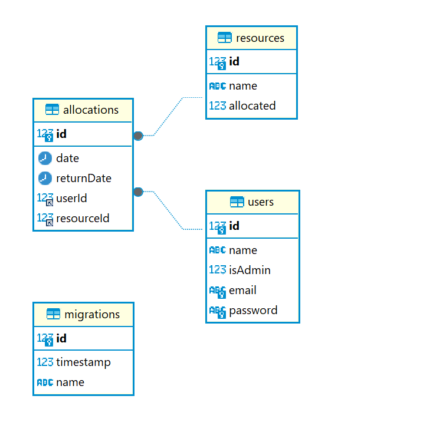

# Gestão de Recursos
Sistema desenvolvido para gestão e alocação de recursos com usuários do sistema

## Tecnologias Utilizadas

### Node.js
Runtime JavaScript back-end

### NestJS
Framework JavaScript para desenvolvimento de APIs Rest

### MySQL
SGBD relacional para persistência dos dados da API

### TypeORM
Biblioteca JavaScript para comunicação abstrata atráves de classes com banco de dados

### Docker
Ferramenta de gestão de containers para execução padronizada de ambientes computacionais

## Arquitetura
Aplicação desenvolvida em 2 camadas:
* API Rest que manipula operações de gestão de usuários, recursos e alocações entre eles atráves e outros HTTP
* Banco de dados para persistência das operações realizadas na API

### Autenticação
A autenticação é realizada atráves de token JWT

### Variáveis de Ambiente
O sistema utiliza variáveis de ambiente para definir credenciais e configurações com base no ambiente em que ela será executada

## Design
O sistema foi desenvolvido utilizando diversos componentes de design:

### Controllers
Manipulação de requisições HTTP que são redirecionadas para os services

### Services
Casos de uso (operações realizadas pelo usuário) através de orquestração de outros componentes para atingir o propósito do caso de uso

### DTOs
tráfego de informações entre componentes do sistema

### Entities
Abstração de operações realizadas no banco de dados

### Guards
Responsável por garantir a camada de autenticação da aplicação

### Utils
Componentes adicionais de configuração e validação do sistema

### Decorators
Componentes utilitários utilizados como decorators em outros componentes

## Entidades
O sistema possui 3 entidades para manipulação e persistência dos dados



### User
Responsável por manipular recursos e alocações à depender de sua função no sistema (administrador ou usuário convencional)
* Administrador: pode gerenciar os recursos do sistema
* Usuário convencional: pode gerenciar alocações de recursos para si mesmo

### Resource 
Entidade genérica que possui um nome e pode ser alocado a um usuário do sistema

### Allocation
Representa uma ação realizada em determinado período onde um recurso foi alocado a um usuário 

## Casos de Uso
O sistema possui diversos casos de uso presente nos componentes services para realizar as operações necessárias

### Criar Usuário
Qualquer pessoa pode criar um usuário do tipo administrador ou usuário convencional

### Login
Deve gerar um token JWT para que o usuário consiga autenticar na API

### Atualizar Usuário
Permitida apenas para usuários autenticados do tipo admin

### Remover Usuário
Permitida apenas para usuários autenticados do tipo admin

### Listar Usuários
Permitida apenas para usuários autenticados do tipo admin

### Consultar Usuário por ID
Permitida apenas para usuários autenticados do tipo admin

### Criar Recurso
Permitida apenas para usuários autenticados do tipo admin

### Atualizar Recurso
Permitida apenas para usuários autenticados do tipo admin

### Remover Recurso
Permitida apenas para usuários autenticados do tipo admin

### Listar Recursos
Permitida para qualquer tipo de usuário autenticado, listando apenas os recursos que estão disponíveis para alocação

### Consultar Recurso por ID
Permitida apenas para usuários autenticados

### Alocar Recurso
Permitida para qualquer tipo de usuário autenticado, aloca um recurso ao usuário autenticado, este recurso não pode ser alocado ou listado para outro usuário enquanto não for desalocado

### Desalocar Recurso
Permitida para qualquer tipo de usuário autenticado, desaloca um recurso ao usuário autenticado

### Listar Alocações
Permitida para qualquer tipo de usuário autenticado, lista alocações realizadas pelo usuário autenticado

## Como executar o projeto

### Requisitos 
* Docker
* Docker Compose

### Passos
* Executar o comando
```
docker compose up
```
<small> O comando acima irá executar o arquivo docker-compose.yml contendo a API e o Banco de Dados, executando as migrations e disponibilizando a API na porta 3001 </small>

### Documentação 
A documentação da API pode ser acessada pela [URL](https://documenter.getpostman.com/view/29129381/2sA3rxqDXm) ou importar diretamente no Postman através [deste link](assets/documentation.json)